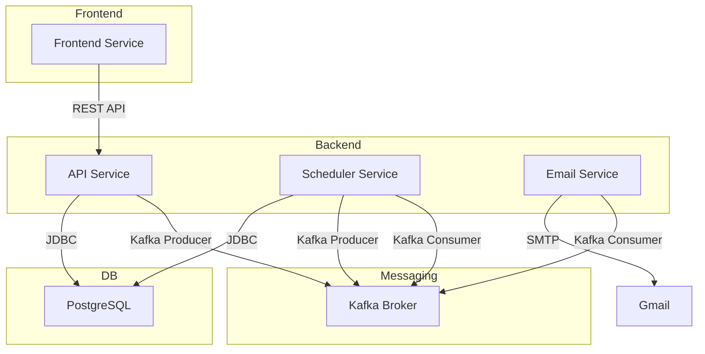

# 📋 Task Tracker API

> Многопользовательский планировщик задач в стиле Trello с микросервисной архитектурой

## 🚀 Обзор проекта

Task Tracker API — современное решение для управления задачами, вдохновленное функциональностью Trello. Проект реализован с использованием микросервисной архитектуры и предоставляет REST API для управления задачами, пользователями и уведомлениями.

## 🛠️ Технологический стек


### Основные технологии:
- **Java 17**
- **Gradle**
- **Spring Framework:**
  - Spring Boot
  - Spring Web
  - Spring Security (JWT)
  - Spring Data JPA
  - Spring for Apache Kafka
  - Spring Scheduler
  - Spring Mail (Gmail)
- **PostgreSQL**
- **Liquibase**
- **Apache Kafka**
- **Docker**
- **CI/CD (GitHub Actions)**

---

## 🏗️ Архитектура приложения

Проект построен на основе **микросервисной архитектуры** и включает четыре основных микросервиса:

### 🔧 API Service
Основной сервис для работы с бизнес-логикой:
- REST API для управления пользователями и задачами
- Аутентификация и авторизация через JWT
- Интеграция с Kafka для отправки уведомлений

### 📧 Email Service
Сервис уведомлений для отправки email:
- Подписка на Kafka топик `EMAIL_SENDING_TASKS`
- Отправка email через Gmail SMTP

### ⏰ Scheduler Service
Сервис планировщика:
- Автоматическая генерация ежедневных отчетов о задачах
- Анализ изменений за сутки для каждого пользователя
- Отправка сводок через Kafka в Email Service

### 💻 Frontend Service
Клиентский фронтенд:
- Панель администратора
- Веб-интерфейс для пользователей
- Интеграция с API Service



---

## 🔄 CI/CD

Проект использует **GitHub Actions** для автоматизации процессов сборки и деплоя:  
- Автоматическая сборка Docker образов микросервисов  
- Публикация образов в Docker Hub  
- Автоматический деплой на удалённый сервер при пуше в основную ветку  

---

## 📦 Структура проекта

task-tracker/

├── api-service/ - Основной REST API сервис

├── frontend-service/ # Веб-клиент

├── scheduler-service/ # Сервис планировщика

├── email-service/ # Сервис рассылки Gmail

├── docker-compose.yaml # Конфигурация Docker контейнеров

└── README.md


## 🚀 Запуск проекта

Для локального запуска проекта достаточно:  

1. Создать копию файла `.env.example` и при необходимости заполнить переменные окружения:  
```bash
cp .env.example .env
```
   Файл .env.example содержит все необходимые настройки для локального запуска.
   
2. Собрать Docker-образы микросервисов и запустить проект:
```bash
docker-compose -f compose.yaml up --build
```

После этого все сервисы будут работать локально, включая API, фронтенд, Scheduler и Email.

## 👨‍💻 Автор

- Telegram: [@grdvt](https://t.me/@grdvt) 
- GitHub: [@Egor250625](https://github.com/Egor250625)
